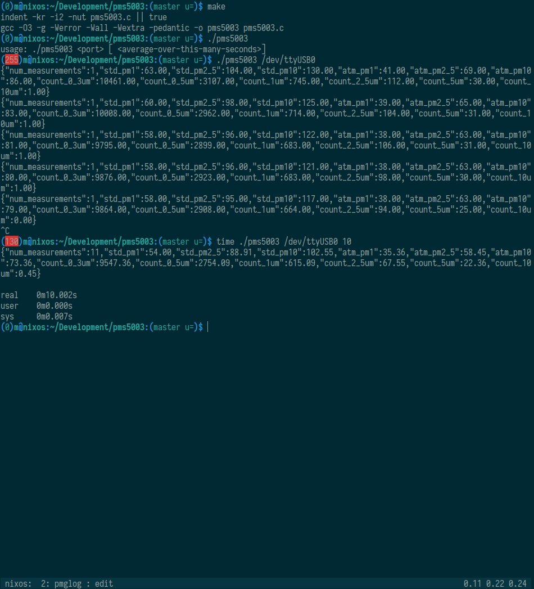

# pms5003

PMS5003 air quality sensor data grabbing in C, to JSON, on Linux, with optional averaging over time.

Data sheet (kind of…): http://www.aqmd.gov/docs/default-source/aq-spec/resources-page/plantower-pms5003-manual_v2-3.pdf.

No bullshit approach, does well what needs to be done, and nothing more.

* If you need HTTP, feed its output to curl.

* If you need warmup, use `/bin/sleep`.

* If you need power management, set your GPIO pins in a shell script, for Christ’s sake.

**Beware of Python-based solutions** which constantly eat 100% CPU (unless you `sleep` artificially), and around 100× as much RAM, cf.

* https://github.com/kzyapkov/pms5003-logger/pull/2#issuecomment-354683717,
* https://www.google.com/search?q=python+serial+100+cpu.

## Screenshot

